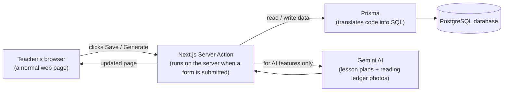

# AI-Powered Academic Workflow Platform

A web app built for **Springdale English Boarding School** (Bhaktapur, Nepal) that replaces
the paper-based grading process for **Grades 1–5** with a digital one — without changing
how teachers actually work. A teacher scores each student the same 1–4 way they already do
in the physical CAS (Continuous Assessment System) register book; the app then does every
calculation automatically and produces the report card. Grades 6–10 use a separate,
existing result-processing system and are out of scope here.

This document explains what the app does, who uses it, and how it's built — written so
that someone with no software background can follow the "what" and "why," and a developer
can use it as a map of the "how."

---

## Table of contents

- [The problem this solves](#the-problem-this-solves)
- [What the app does](#what-the-app-does)
  - [As a school admin](#as-a-school-admin)
  - [As a teacher](#as-a-teacher)
- [The core pipeline](#the-core-pipeline)
- [How it's built (architecture, in plain terms)](#how-its-built-architecture-in-plain-terms)
- [The data model, in plain terms](#the-data-model-in-plain-terms)
- [Security model](#security-model)
- [Tech stack](#tech-stack)
- [Project structure](#project-structure)
- [Getting started](#getting-started)
- [Demo credentials](#demo-credentials)
- [What's not built yet](#whats-not-built-yet)
- [Further reading](#further-reading)

---

## The problem this solves

At Springdale, every student's marks live in a physical paper register. A teacher fills in
a score from **1 to 4** (Needs Improvement → Basic → Proficient → Advanced) for each skill
area, for each unit, for every student — by hand, in a book. At report-card time, someone
has to add all of those numbers up, convert the total into a percentage, look up the
matching letter grade, and repeat that for every subject and every student. It's slow,
it's easy to get wrong, and the only copy of a term's marks is that one physical book.

This app digitizes exactly that process — same scale, same formula, same grading table —
so the arithmetic happens automatically and a full report card is always one click away.

## What the app does

There are two kinds of user: a **school admin** (sets the school up) and a **teacher**
(does the actual teaching and grading). Each logs in at `/login` and is sent to their own
part of the app.

### As a school admin

An admin manages the school's structure — the things that rarely change day to day:

| Screen | What it's for |
|---|---|
| Academic Years | Define school years (e.g. "2082/83 B.S.") and mark the active one |
| Grades & Sections | Create grades (1–5) and their sections (e.g. "Grade 3 – A") |
| Subjects | The list of subjects taught (English, Nepali, Mathematics, etc.) |
| Teachers | Create teacher accounts |
| Assignments | Assign a teacher to teach a specific subject to a specific grade/section |
| Students | Manage each section's student roster |

Every one of these is a normal add/edit/delete screen, scoped so an admin only ever sees
and touches their own school's data.

### As a teacher

A teacher's home page ("My Classes") lists every subject/grade they've been assigned to
teach. From there:

- **Curriculum** — browse what to teach: every subject's units for a grade, each unit's
  skill areas, and the standard grading rubrics for that subject. Read-only reference
  material, organized the way the official curriculum is organized.
- **Planning + AI Lesson Plans** — pick a curriculum unit and the app breaks it into a
  suggested sequence of class periods. For any period, one click asks Google's Gemini AI
  to draft a full lesson plan (objectives, activities, teaching methods, materials,
  homework, assessment ideas) — which the teacher then edits and saves like a normal
  document. AI drafts it, the teacher owns the final version.
- **Assessment (the CAS scoring itself)** — for a chosen class and unit, a spreadsheet-like
  grid lists every student down the side and every skill area across the top, with a
  dropdown (1–4) per cell — exactly mirroring the paper register's layout. Opening a single
  student additionally offers:
  - a **remedial ("after support") score and a remarks field** per skill area, for
    students who needed a second attempt;
  - **rubric-based grading** — four standard rubrics (Classroom Participation, Oral Task,
    Written Task, Project & Practical Work), transcribed directly from the school's own
    rubric booklet, click-to-score by criterion; a teacher can also create a **custom
    rubric** scoped to just that one unit;
  - a **grading-scale reference table**, so the conversion rule is always visible;
  - **"photograph the paper ledger"** — instead of typing scores in by hand, a teacher can
    photograph the filled-in paper page for that student and unit. Gemini's vision model
    reads the handwritten 1–4 digits and pre-fills the form; the teacher reviews the
    photo side-by-side with the extracted numbers and saves — nothing is written to the
    database until a human confirms it.
- **Report Card** — pick a class, pick a student, and see every subject's percentage/GPA/
  letter grade rolled up automatically, plus that student's overall **GPA**, **WGPA**
  (weighted by each subject's credit weight), and **Percentage**. This updates live: score
  a student in the Assessment screen, and their Report Card reflects it immediately.

A small "Guide" button on both the admin and teacher sides opens a slide-over panel
explaining the scoring scale and formulas in place, for anyone who needs a refresher
without leaving the page.

## The core pipeline

Everything above exists to make this one flow effortless:

```
 1. Marks Entry            Teacher scores 1-4 per skill area, per student
        │                  (grid view, or per-student detail, or photograph the ledger)
        ▼
 2. Auto-Calculate         percentage = (sum of scores) ÷ (4 × number of scores) × 100
        │                  percentage → GPA + letter grade, via a fixed lookup table
        ▼
 3. Roll-up                Every unit in a subject combines into that subject's result;
        │                  every subject combines into the student's overall GPA/WGPA/%
        ▼
 4. Report Card            Ready to view — nothing was manually tallied
```

The grading table (verified against the school's own physical register) is:

| Percentage | GPA | Grade |
|---|---|---|
| 90% and up | 4.0 | A+ |
| 80–89% | 3.6 | A |
| 70–79% | 3.2 | B+ |
| 60–69% | 2.5 | B |
| 50–59% | 2.4 | C+ |
| 40–49% | 2.0 | C |
| 35–39% | 1.6 | D |
| below 35% | — | NG (Not Graded) |

## How it's built (architecture, in plain terms)

The app is a single **Next.js** website — one program that renders every page and also
handles every "save" button, with no separate backend server to run. A simplified request
looks like this:



A few terms explained, since they show up throughout the codebase:

- **Next.js App Router**: the framework decides which page to show based on the URL's
  folder path under `app/` (e.g. `app/teacher/report-card/page.tsx` serves
  `/teacher/report-card`). No separate router configuration to maintain.
- **Server Action**: instead of a separate API, a form's "Save" button calls a function
  that runs directly on the server (each feature's `actions.ts` file). It reads the
  submitted data, checks the user is allowed to make that change, writes to the database,
  and tells the browser to refresh the affected page.
- **Prisma**: an ORM (object-relational mapper) — code describes "give me this student's
  scores" instead of hand-written SQL, and Prisma generates the actual database query.
  The full shape of every table lives in one file, [`prisma/schema.prisma`](prisma/schema.prisma).
- **PostgreSQL**: the actual database, running in a Docker container locally.
- **Auth.js (NextAuth)**: handles login. A successful sign-in issues a signed session
  token (JWT) containing the user's ID, role, and school — every subsequent page read from
  it to decide what to show and what to allow.
- **Gemini API**: Google's AI model, called for two distinct features — drafting a lesson
  plan from a curriculum unit, and reading handwritten scores off a photographed ledger
  page. Both are one-shot calls: send a prompt (and, for the ledger, an image), get
  structured JSON back.

## The data model, in plain terms

The database (see [`prisma/schema.prisma`](prisma/schema.prisma) for the exact shape)
splits into three groups of tables:

1. **Organization data** — `School`, `AcademicYear`, `Grade`, `Section`, `Subject`,
   `User` (admins and teachers), `Student`, `TeacherAssignment`. This is *who* the school
   is and *who* teaches *what* to *whom*. Every row belongs to exactly one school.
2. **Curriculum reference data** — `CurriculumGrade` → `CurriculumSubject` →
   `CurriculumUnit` → `SkillArea` / `LearningAchievement`, plus `Rubric` /
   `RubricCriterion`. This is the shared "what should be taught and how it should be
   graded" content — not tied to any one student.
3. **Assessment data** — `AssessmentScore` (a student's 1–4 score for one skill area, plus
   an optional remedial score and remark), `RubricScore` (a student's 1–4 score for one
   rubric criterion), `LedgerPhoto` (a stored photo of a paper ledger page). This is the
   actual, growing record of what each student has actually scored.

A report card is computed, not stored: it reads every `AssessmentScore` for a student
across every unit of a subject, averages them into that subject's percentage/GPA, and
averages every subject together for the overall GPA/WGPA/percentage — live, on every page
load.

## Security model

Every admin and teacher route is gated by an authenticated session — no page is reachable
without logging in first, and a teacher account cannot open an admin page or vice versa.

Beyond that, every Server Action that reads or writes a specific record (a student, an
assignment, a curriculum unit) re-checks — on the server, not just trusting what the page
already displayed — that the record actually belongs to the current user's school (for
admin actions) or the current teacher's own assignment (for assessment actions), before
doing anything with it. This closes a class of bug called IDOR (Insecure Direct Object
Reference): even if someone crafted a request with a different ID than the app's own UI
would ever send, the server independently re-verifies ownership rather than trusting the
request. Passwords are hashed with bcrypt; nothing is ever stored or logged in plain text.

## Tech stack

| Layer | Choice |
|---|---|
| Framework | [Next.js 16](https://nextjs.org) (App Router, TypeScript, Turbopack) |
| Styling | Tailwind CSS 4 |
| Database | PostgreSQL, via Docker |
| ORM | Prisma 7 (`@prisma/adapter-pg` driver adapter) |
| Auth | Auth.js / NextAuth v5, credentials provider, JWT sessions |
| Password hashing | bcryptjs |
| AI | Google Gemini API (`@google/genai`), model `gemini-2.5-flash` |
| Validation | Zod |

## Project structure

```
app/
  admin/            Admin pages + their Server Actions (one folder per screen)
  teacher/           Teacher pages + Server Actions:
    curriculum/        the read-only curriculum browser
    planning/          curriculum unit -> period breakdown
    lesson-plans/      AI-generated lesson plan editor
    assessment/        the CAS scoring grid, per-student detail, rubrics, ledger photo
    report-card/       cross-subject GPA/WGPA/Percentage rollup
  login/             Login page + its Server Action
  api/auth/          Auth.js's own API route
components/
  ui/                Shared building blocks (buttons, breadcrumbs, save banners, selects)
  assessment/        Assessment-screen-specific components (rubric scorer, ledger upload, guide)
lib/
  auth.ts            Auth.js configuration (the credentials provider, session shape)
  prisma.ts          The Prisma client instance every Server Action imports
  grading.ts         The CAS formula, the grade-scale table, report-card roll-up math
  gemini.ts          The Gemini client instance
  lesson-plan.ts     Prompt + schema for AI lesson-plan generation
  ledger-scan.ts     Prompt + schema for reading a photographed ledger page
prisma/
  schema.prisma      The full database shape
  migrations/        Every applied schema change, in order
  seed.ts            Demo data: a full school, rosters, curriculum, rubrics
```

## Getting started

1. Start Postgres (Docker Desktop must be running):

   ```bash
   docker compose up -d
   ```

2. Install dependencies:

   ```bash
   npm install
   ```

3. Fill in `.env` (copy the three keys below into it):

   - `DATABASE_URL` — already set to match `docker-compose.yml`, no change needed.
   - `AUTH_SECRET` — any random string; generate one with `openssl rand -base64 32`.
   - `GEMINI_API_KEY` — a free key from
     [aistudio.google.com/apikey](https://aistudio.google.com/apikey) (no credit card
     required). Lesson-plan generation and ledger-photo scanning won't work without this,
     but everything else will.

4. Apply migrations and seed demo data:

   ```bash
   npx prisma migrate dev
   npm run db:seed
   ```

   This creates a demo school ("Springdale English Boarding School") with an admin and a
   teacher account, a full Grades 1–5 student roster, and every subject's curriculum units
   and standard rubrics. It does **not** enter any marks — the register starts blank, the
   same way it would for a real school, ready for a teacher to score a class through the
   Assessment screen (after which the Report Card fills in automatically).

5. Run the dev server:

   ```bash
   npm run dev
   ```

   Open http://localhost:3000 — you'll be redirected to `/login`, then to `/admin` or
   `/teacher` depending on which demo account you sign in with.

Other useful commands: `npm run db:studio` (Prisma Studio — browse the database in a
GUI), `npm run build` (production build + typecheck), `npm run lint`.

## Demo credentials

| Role | Email | Password |
|---|---|---|
| Admin | `admin@springdale.edu.np` | `Admin@123` |
| Teacher | `teacher@springdale.edu.np` | `Teacher@123` |

## What's not built yet

This app is ready to demo, and the core pipeline (marks entry → GPA/WGPA/Percentage →
report card) genuinely works end-to-end. Before it replaces the paper process for real
students, the following are still open — tracked in detail in
[READINESS_REPORT.md](READINESS_REPORT.md):

- **No hosting** — the app has only run locally via `npm run dev` against a local Docker
  database; it isn't deployed anywhere yet.
- **No printable/PDF report card** — the report card is a web page today, not an export.
- **No "Term" concept** — the report card aggregates the whole academic year, not a
  specific term/quarter.
- **WGPA equals GPA today** — every subject's credit weight defaults to `1`; there's no
  admin screen yet to give some subjects more weight than others.
- **Curriculum content is AI-authored, first draft** — calibrated to the school's verified
  grading structure and rubric booklet, but not yet signed off by a teacher as the
  official curriculum.
- **Real student rosters** aren't loaded in yet — the app currently runs on seeded demo
  students.
- Other assessment-tool types from the rubric booklet beyond the 4 rubrics (Checklist,
  Rating Scale, Anecdotal Record, Peer/Self/Parent feedback) aren't built.
- No automated test suite — everything has been verified through live, manual testing.

## Further reading

- [HANDBOOK.md](HANDBOOK.md) — deeper domain knowledge (what was learned from the
  school's physical register photos) and architecture/decision log.
- [PROGRESS.md](PROGRESS.md) — feature-by-feature build history.
- [READINESS_REPORT.md](READINESS_REPORT.md) — the full production-readiness review:
  what was tested, the security audit and fixes, and what's left before going live.
